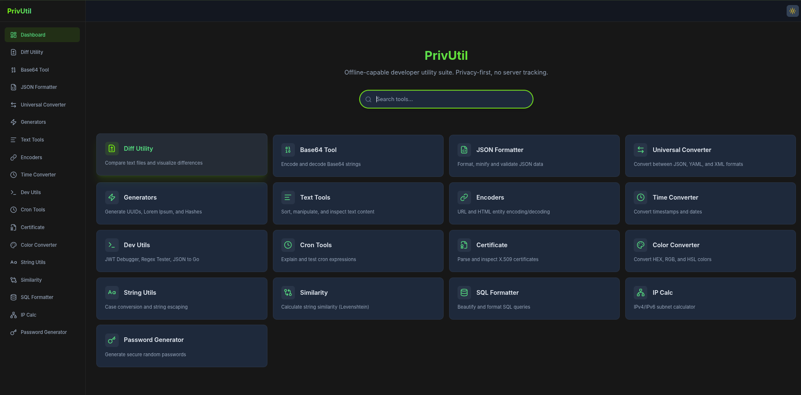

# PrivUtil


[!NOTE]
This project was "developed" with Antigravity AI. I am the owner of the project and I am using it to help me with my development tasks and to learn more about AI development while vive coding. This project was started from scratch and it took the length of TROLL and TROLL2 movies to build.

**PrivUtil** is a privacy-first, offline-capable developer utility suite. Built with **Go** and **React**, it provides 20+ tools for data manipulation, formatting, conversion, and generation — all running locally with zero server tracking.



---

## ✨ Features

### Core Utilities

| Tool             | Description                               |
| ---------------- | ----------------------------------------- |
| **Diff Utility** | Compare text with visual highlighting     |
| **Base64**       | Encode/Decode Base64 strings              |
| **Text Tools**   | Sort, dedupe, reverse, trim, inspect text |
| **Similarity**   | Calculate Levenshtein distance            |

### Formatters & Converters

| Tool                    | Description                                   |
| ----------------------- | --------------------------------------------- |
| **JSON**                | Format, minify, validate                      |
| **Universal Converter** | JSON ↔ YAML ↔ XML                             |
| **SQL Formatter**       | Beautify SQL queries                          |
| **Color Converter**     | HEX ↔ RGB ↔ HSL with live preview             |
| **Case Converter**      | camelCase, snake_case, PascalCase, kebab-case |
| **Time Converter**      | Unix timestamps, timezone conversion          |
| **IP Calculator**       | IPv4/IPv6 subnet calculations                 |

### Generators & Security

| Tool                   | Description                             |
| ---------------------- | --------------------------------------- |
| **UUID**               | Generate v1-v8 UUIDs                    |
| **Hash Calculator**    | MD5, SHA1, SHA256, SHA512               |
| **Lorem Ipsum**        | Generate placeholder text               |
| **Password Generator** | Secure random passwords                 |
| **Encoders**           | URL, HTML entity encode/decode          |
| **JWT Debugger**       | Decode and inspect JWTs                 |
| **Certificate Parser** | Parse X.509 PEM certificates            |
| **Cron Tools**         | Explain cron expressions with next runs |
| **Regex Tester**       | Test Go-compatible regex patterns       |
| **JSON to Go**         | Generate Go struct from JSON            |

---

## 🚀 Quick Start

> [!IMPORTANT]
> **PrivUtil should NOT be installed via `go install`.**
> This project uses an embedded web component that must be built separately. Standard `go install` fails to bundle these assets correctly, resulting in an incomplete application. Please use the pre-compiled binaries from the [Releases](https://github.com/odinnordico/privutil/releases) page or build from source using the provided `Makefile`.

### Docker

Check out the project packages [here](https://github.com/odinnordico/privutil/packages)

```bash
docker pull ghcr.io/odinnordico/privutil:latest
docker run --rm -p 8090:8090 ghcr.io/odinnordico/privutil:latest
```

### Download from Releases

Download the latest binary for your platform from the [Releases](https://github.com/odinnordico/privutil/releases) page.

#### Linux / macOS

```bash
# Example for Linux AMD64
tar -xzf privutil-linux-amd64.tar.gz
./privutil
```

#### Windows

1. Right-click the `.zip` file and select **Extract All...**
2. Run `privutil.exe`

### Build from Source

```bash
# Clone the repository
git clone https://github.com/odinnordico/privutil.git
cd privutil

# Build everything
make build

# Run
./privutil
```

Access at **http://localhost:8090**

### CLI Options

```bash
./privutil --help

Options:
  -port string      Port to listen on (default "8090")
  -host string      Host to bind to (default: all interfaces)
  -log-level string Log level: debug, info, warn, error (default "info")
  -version          Print version and exit
```

Environment variables: `PORT`, `HOST`, `LOG_LEVEL`

---

## 🛠️ Development

### Prerequisites

- **Go** 1.21+
- **Node.js** 18+
- **Make**

### Makefile Commands

```bash
make build          # Build frontend + backend
make run            # Build and run
make clean          # Clean build artifacts
make test           # Run all tests
make test-backend   # Go tests with coverage
make test-frontend  # Vitest tests
make test-coverage  # Generate coverage reports
make lint           # Run linters
make proto          # Regenerate protobuf code
```

### Project Structure

```
privutil/
├── cmd/privutil/       # Main application entry
├── internal/
│   ├── api/            # gRPC service implementation
│   └── server/         # HTTP/gRPC-Web server
├── proto/              # Protocol Buffer definitions
├── web/                # React frontend (Vite + Tailwind)
│   ├── src/components/ # UI components
│   └── src/lib/        # Shared utilities
└── Makefile
```

---

## 🎨 Theme

PrivUtil features a **Kawasaki Lime** theme with dark/light mode toggle:

- **Primary Accent**: #76FF03 (Neon Green)
- **Default Mode**: Dark
- Toggle in the top-right header

---

## 🧪 Testing

### Backend (Go)

- **Coverage**: 82%+ on core business logic
- Tests for all 20+ gRPC methods

```bash
go test -tags=manual -cover ./...
```

### Frontend (React/Vitest)

- 16 tests across 4 test files
- Dashboard, ThemeToggle, utilities coverage

```bash
cd web && npm test
```

---

## 🤝 Contributing

1. Fork the repository
2. Create a feature branch: `git checkout -b feature/amazing`
3. Make changes and add tests
4. Run linters: `make lint`
5. Run tests: `make test`
6. Commit: `git commit -m "feat: Add amazing feature"`
7. Push and open a Pull Request

See [CONTRIBUTING.md](CONTRIBUTING.md) for detailed guidelines.

---

## 📄 License

MIT License — See [LICENSE](LICENSE) for details.
