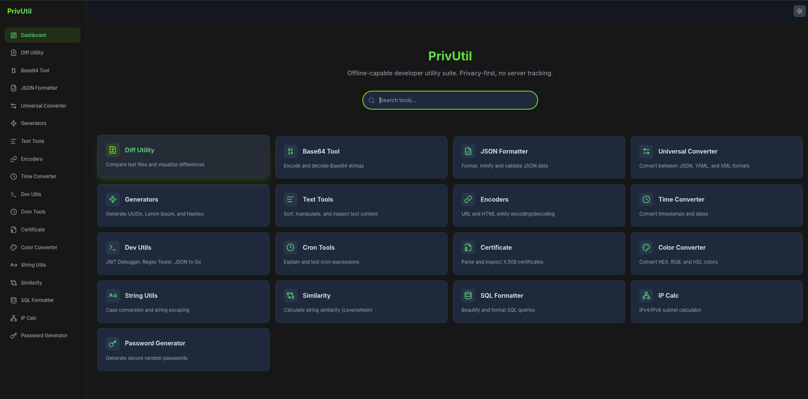

# PrivUtil


[!NOTE]
This project was "developed" with Antigravity AI. I am the owner of the project and I am using it to help me with my development tasks and to learn more about AI development while vive coding. This project was started from scratch and it took the length of TROLL and TROLL2 movies to build.

**PrivUtil** is a privacy-first, offline-capable developer utility suite. Built with **Go** and **React**, it provides 65+ tools across 11 categories for data manipulation, formatting, conversion, generation, and more — all running locally with zero server tracking.



---

## ✨ Features

### Data & Diff

| Tool | Description |
| ---- | ----------- |
| **Diff Utility** | Visual text comparison with syntax highlighting |
| **Text Tools** | Sort, dedupe, reverse, trim, inspect line count/word count/bytes |
| **Text Similarity** | Levenshtein distance and similarity percentage |

### Formatters & Converters

| Tool | Description |
| ---- | ----------- |
| **JSON Formatter** | Format, minify, sort keys, validate |
| **Universal Converter** | JSON ↔ YAML ↔ XML ↔ TOML ↔ CSV (bidirectional, configurable delimiter) |
| **Data Validator** | Validate JSON, YAML, XML, TOML with line/column error reporting |
| **SQL Formatter** | Beautify and format SQL queries |
| **Color Converter** | HEX ↔ RGB ↔ HSL with live preview |
| **Case Converter** | camelCase, snake_case, PascalCase, kebab-case, CONSTANT_CASE, Title Case |
| **Time Converter** | Unix timestamps, timezone conversion, ISO 8601 |
| **Number Base Converter** | Decimal ↔ Hex ↔ Binary ↔ Octal ↔ Base64 |
| **IP Calculator** | IPv4/IPv6 subnet, network/broadcast/hosts |
| **Markdown ↔ HTML** | Bidirectional conversion |
| **HTML/MD Viewer** | Render HTML or Markdown in a sandboxed iframe with strict CSP, file upload (.html/.md), opt-in images |

### Generators

| Tool | Description |
| ---- | ----------- |
| **UUID Generator** | v1, v2, v3, v4, v5, v6, v7, v8; configurable hyphens, uppercase, count |
| **Hash Calculator** | MD5, SHA-1, SHA-256, SHA-512, bcrypt (configurable cost) |
| **Lorem Ipsum** | Words, sentences, paragraphs, configurable count |
| **Password Generator** | Custom charset, length, uppercase/lowercase/digits/symbols, bulk generation |
| **RSA Key Pair** | 1024/2048/4096-bit key generation |

### Encoding & Crypto

| Tool | Description |
| ---- | ----------- |
| **Base64** | Encode/decode strings |
| **URL Encoder/Decoder** | Percent-encoding |
| **HTML Entity Encoder/Decoder** | Named and numeric entities |
| **HMAC Generator** | SHA-256/SHA-512/SHA-1/MD5 with hex and base64 output |
| **OTP/TOTP** | Generate and validate RFC 6238 codes; generate secrets; configurable period/digits/algo |
| **ULID Generator** | Monotonic option, bulk generation |
| **Caesar Cipher / ROT13** | Arbitrary shift, encode/decode |
| **Text Encode** | Text ↔ binary, hex, octal, decimal codepoints |
| **Morse Code** | Encode/decode with standard alphabet |
| **Basic Auth Generator** | Encode/decode `user:password` as Authorization header |

### Developer Tools

| Tool | Description |
| ---- | ----------- |
| **JWT Debugger** | Decode header and payload; highlights expiration |
| **Regex Tester** | Go-compatible regex, match highlighting, captured groups |
| **JSON to Go** | Generate Go structs with json tags from any JSON |
| **Cron Tools** | Explain cron expressions, next 5 run times |
| **Certificate Parser** | Parse X.509 PEM certificates (subject, issuer, SANs, validity) |
| **String Escape/Unescape** | JSON, Java, SQL, HTML entity modes |

### Network Tools

| Tool | Description |
| ---- | ----------- |
| **Subnet Calculator** | IPv4/IPv6 CIDR: network, broadcast, netmask, host range, count |
| **chmod Calculator** | Interactive Unix permission calculator; octal ↔ symbolic ↔ checkboxes; setuid/setgid/sticky |
| **IPv4 Converter** | Decimal ↔ dotted ↔ hex ↔ binary representations |
| **IPv4 Range Expander** | Start+end → individual IPs + CIDR summary |
| **Port Generator** | Random port(s), configurable range, exclude well-known |
| **MAC Address Generator** | Random or OUI-specific, configurable separator, unicast/local bits |

### Text & String

| Tool | Description |
| ---- | ----------- |
| **Slugify** | URL-safe slug with separator, uppercase, max-length options |
| **Hidden Character Detector** | Reveals zero-width spaces, BOM, non-breaking spaces; annotated/cleaned output |
| **Find & Replace** | Plain text or regex, case-insensitive option, replacement count |
| **String Obfuscator** | Partial masking, configurable keep-start/keep-end/mask-char |
| **Numeronym Generator** | i18n, k8s, a11y style |
| **NATO Alphabet** | Encode/decode text to/from NATO phonetic alphabet |
| **List Tools** | Sort A-Z/Z-A/numeric, dedupe, shuffle, unique-only, duplicates, frequency, reverse, trim, remove-empty |

### Math & Units

| Tool | Description |
| ---- | ----------- |
| **Math Expression Evaluator** | Recursive-descent parser, 30+ functions (trig, log, factorial, gcd, lcm, clamp, lerp…), variables, degrees mode, configurable precision |
| **Percentage Calculator** | 4 modes: X% of Y, X is what % of Y, % change, reverse percentage |
| **Temperature Converter** | Celsius ↔ Fahrenheit ↔ Kelvin with formulas |
| **Unit Converter** | 6 categories: bytes (SI+binary), length, mass, area, volume, speed |

### Date & Time

| Tool | Description |
| ---- | ----------- |
| **Date Difference** | Calendar-aware diff (years/months/days/hours/minutes/seconds + totals + human summary) |
| **Leap Year Checker** | Single year, comma list, or YYYY-YYYY range |
| **Date Add/Subtract** | Add/subtract years, months, weeks, days, hours, minutes, seconds |
| **Date Formatter** | 20+ output formats: ISO 8601, RFC 2822/850, Unix (s/ms/µs/ns), ordinal, SQL, ISO week date… |
| **Date Info** | Week number, quarter, zodiac sign, season, day-of-year, days-left, days-since-epoch |

### Web & DevOps

| Tool | Description |
| ---- | ----------- |
| **URL Parser** | Scheme, credentials, host, port, path, query params (table), fragment, normalized URL |
| **User-Agent Parser** | Browser, version, OS, engine, device type (desktop/mobile/tablet/bot) |
| **HTTP Status Codes** | Searchable reference of all 63 codes (1xx–5xx) with descriptions, filterable by category |
| **MIME Type Lookup** | Bidirectional: extension → MIME or MIME → extensions; 75+ types; category filter |
| **Docker run → Compose** | Full flag parser (30+ flags), quoted-string aware, generates docker-compose.yml with warnings for unsupported flags |
| **Git Cheat Sheet** | 11 categories, 120+ commands, searchable, copy-on-click |

### Media Tools

| Tool | Description |
| ---- | ----------- |
| **SVG Optimizer** | 4 presets (safe/aggressive/minimal/custom), 9 configurable transforms, size stats, inline preview |
| **Image Metadata (EXIF)** | JPEG full EXIF (camera/GPS/settings), PNG chunks (IHDR/tEXt/iTXt/pHYs), WebP RIFF; GPS decimal + DMS + Maps link |
| **Base64 ↔ File** | Encode any file to base64/data URI; decode base64/data URI to downloadable file; image preview |

---

## 🚀 Quick Start

> [!IMPORTANT]
> **PrivUtil should NOT be installed via `go install`.**
> This project uses an embedded web component that must be built separately. Standard `go install` fails to bundle these assets correctly, resulting in an incomplete application. Please use the pre-compiled binaries from the [Releases](https://github.com/odinnordico/privutil/releases) page or build from source using the provided `Makefile`.

### Docker

Check out the project packages [here](https://github.com/odinnordico/privutil/packages)

```bash
docker pull ghcr.io/odinnordico/privutil:latest
docker run --rm -p 8090:8090 ghcr.io/odinnordico/privutil:latest
```

### Download from Releases

Download the latest binary for your platform from the [Releases](https://github.com/odinnordico/privutil/releases) page.

#### Linux / macOS

```bash
# Example for Linux AMD64
tar -xzf privutil-linux-amd64.tar.gz
./privutil
```

#### Windows

1. Right-click the `.zip` file and select **Extract All...**
2. Run `privutil.exe`

### Build from Source

```bash
# Clone the repository
git clone https://github.com/odinnordico/privutil.git
cd privutil

# Build everything
make build

# Run
./privutil
```

Access at **http://localhost:8090**

### CLI Options

```bash
./privutil --help

Options:
  -port string      Port to listen on (default "8090")
  -host string      Host to bind to (default "localhost")
  -log-level string Log level: debug, info, warn, error (default "info")
  -version          Print version and exit
```

Environment variables: `PORT`, `HOST`, `LOG_LEVEL`

---

## 🛠️ Development

### Prerequisites

- **Go** 1.21+
- **Node.js** 18+
- **Make**

### Makefile Commands

```bash
make build          # Build frontend + backend
make build-web      # Build React frontend only
make build-go       # Build Go binary only (requires web/dist to exist)
make run            # Build and run
make clean          # Clean build artifacts
make test           # Run all tests
make test-backend   # Go tests with coverage
make test-frontend  # Vitest tests
make test-coverage  # Generate HTML coverage reports
make lint           # Run all linters
make lint-backend   # go vet + go fmt
make lint-frontend  # ESLint
make proto          # Regenerate protobuf code
```

### Project Structure

```
privutil/
├── cmd/privutil/       # Main application entry point
├── internal/
│   ├── api/            # gRPC service implementations (domain-grouped handlers)
│   └── server/         # HTTP/gRPC-Web server
├── proto/              # Protocol Buffer definitions and generated Go code
├── web/                # React frontend (Vite + Tailwind)
│   ├── src/components/ # UI tool components
│   ├── src/lib/        # Shared utilities and navigation
│   └── src/proto/      # Generated TypeScript proto bindings
└── Makefile
```

**Request flow:**
```
Browser (React + nice-grpc-web) → HTTP server (gRPC-Web wrapper) → gRPC handlers → Go business logic
```

---

## 🎨 Theme

PrivUtil features a **Kawasaki Lime** theme with dark/light mode toggle:

- **Primary Accent**: #76FF03 (Neon Green)
- **Default Mode**: Dark
- Toggle in the top-right header

---

## 🧪 Testing

### Backend (Go)

- **Coverage**: 85%+ on core business logic
- 150+ tests covering all gRPC handler methods

```bash
go test -tags=manual -cover ./...
```

### Frontend (React/Vitest)

- Dashboard, ThemeToggle, and component utilities coverage

```bash
cd web && npm test
```

---

## 🤝 Contributing

1. Fork the repository
2. Create a feature branch: `git checkout -b feature/amazing`
3. Make changes and add tests
4. Run linters: `make lint`
5. Run tests: `make test`
6. Commit using [Conventional Commits](https://www.conventionalcommits.org/): `git commit -m "feat: Add amazing feature"`
7. Push and open a Pull Request

See [CONTRIBUTING.md](CONTRIBUTING.md) for detailed guidelines.

---

## 📄 License

MIT License — See [LICENSE](LICENSE) for details.
